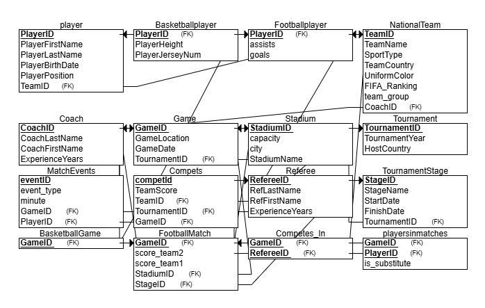

# מערכת ניהול טורניר כדורסל בין נבחרות  
מגישה: שרה בורגן  
היחידה הנבחרת: טורניר לאומי

---

## תוכן עניינים  
- [מבוא](#מבוא)  
- [ERD – תרשים ישויות וקשרים](#erd--תרשים-ישויות-וקשרים)  
- [DSD – תרשים מבנה נתונים](#dsd--תרשים-מבנה-נתונים)  
- [החלטות עיצוב](#החלטות-עיצוב)  
- [שיטות הכנסת נתונים](#שיטות-הכנסת-נתונים)  
  - [שיטה 1: Mockaroo](#שיטה-1-mockaroo)  
  - [שיטה 2: GenerateData](#שיטה-2-generatedata)  
  - [שיטה 3: Python Script](#שיטה-3-python-script)  
- [גיבוי ושחזור](#גיבוי-ושחזור)
- [שלב ב – שאילתות ועדכונים](#שלב-ב--שאילתות-ועדכונים)
  - [שאילתות SELECT](#שאילתות-select)
  - [שאילתות UPDATE](#שאילתות-update)
  - [שאילתות DELETE](#שאילתות-delete)
  - [אילוצים Constraints](#אילוצים-constraints)
- [שלב ג – אינטגרציה ומבטים](#שלב-ג--אינטגרציה-ומבטים)
  - [תרשים ERD](#תרשים-erd)
  - [תרשים DSD](#תרשים-dsd)
  - [החלטות אינטגרציה](#החלטות-אינטגרציה)
  - [מבט 1 – שחקני כדורסל לפי נבחרת](#מבט-1--שחקני-כדורסל-לפי-נבחרת)
  - [מבט 2 – שחקני כדורגל לפי משחקים](#מבט-2--שחקני-כדורגל-לפי-משחקים)
- [שלב ד – תכנות](#שלב-ד--תכנות)
  - [תוכנית ראשונה](#תוכנית-ראשונה)
  - [תוכנית שניה](#תוכנית-שניה)

---

## מבוא

מסד הנתונים של טורניר הכדורסל בין נבחרות לאומיות נבנה כדי לעזור לנהל בצורה מסודרת את כל מה שקשור לטורניר: קבוצות, שחקנים, מאמנים, שופטים, משחקים וטורנירים שמתקיימים כל שנה.

המערכת מאפשרת לשמור ולעקוב אחרי כל הפרטים שצריך – כמו מי שיחק מול מי, איזה שופט שפט איזה משחק, כמה נקודות כל קבוצה קיבלה, מי המאמן של כל קבוצה, ועוד.

### מטרת מסד הנתונים

המערכת נועדה לאפשר:

- רישום של קבוצות (נבחרות לאומיות) עם שם, מדינה, צבע מדים ומאמן.
- תיעוד של טורנירים לפי שנה ומדינה מארחת.
- יצירת משחקים כחלק מהטורניר.
- שיבוץ שופטים לכל משחק.
- שמירת תוצאה של כל קבוצה בכל משחק.
- תיעוד של שחקנים – כולל שם, תאריך לידה, גובה, תפקיד בקבוצה ומספר חולצה.

### שימושים אפשריים

- מנהלי הטורניר יכולים לתכנן בקלות את הטורניר, לנהל את הקבוצות, לקבוע משחקים ולשבץ שופטים.
- מאמנים יכולים לראות מי נמצא בקבוצה שלהם, לעקוב אחרי משחקים ולנתח תוצאות.
- שופטים משובצים למשחקים לפי הצורך, והמערכת שומרת את המידע הזה.
- סטודנטים או מנהלי מידע יכולים לשלוף מידע וסטטיסטיקות על קבוצות, שחקנים וטורנירים.

### למה זה חשוב

מסד הנתונים עוזר לעשות סדר בכל המידע שקשור לטורניר. הוא שומר על דיוק, מאפשר שליפות מהירות של מידע, ויכול בעתיד גם להתחבר לאתר או מערכת חיצונית להצגת התוצאות.

---

## ERD – תרשים ישויות וקשרים  

---

## DSD – תרשים מבנה נתונים  

---

## החלטות עיצוב

- שימוש בטבלת Compets לקישור תוצאות משחקים עם קבוצות, משחקים וטורנירים.
- שימוש בטבלת Officiated_By עם מפתח משולב GameID + RefereeID.
- כל שחקן שייך לנבחרת אחת בלבד (TeamID).
- כל משחק שייך לטורניר אחד בלבד.

---

## שיטות הכנסת נתונים

### שיטה 1: Mockaroo  
שימש ליצירת נתונים עבור הטבלאות:
- Coach
- Game  
- Referee  
- Tournament  

קבצים לדוגמה:  
- [CoachMOCK_DATA.csv](שלב%20א/mockarooFiles/CoachMOCK_DATA.csv)  
- [GameMOCK_DATA.csv](שלב%20א/mockarooFiles/GameMOCK_DATA.csv)  
- [RefereeMOCK_DATA.csv](שלב%20א/mockarooFiles/RefereeMOCK_DATA.csv)  
- [TournamentMOCK_DATA.csv](שלב%20א/mockarooFiles/TournamentMOCK_DATA.csv)

תמונה:

---

### שיטה 2: GenerateData  
שימש ליצירת נתונים עבור:
- Compets  
- NationalTeam  

קבצים לדוגמה:  
- [Competsgeneratedata.csv](שלב%20א/generatedataFiles/Competsgeneratedata.csv)  
- [nationalteamgenerateData.csv](שלב%20א/generatedataFiles/nationalteamgenerateData.csv)

תמונה:

---

### שיטה 3: Python Script  
שימש ליצירת פקודות SQL עבור:
- Officiated_By  

קבצי קוד:  
- [generate_officiated_by.py](שלב%20א/Programing/generate_officiated_by.py)

קבצי פלט:  
- [insert_officiated_by.sql](שלב%20א/Programing/insert_officiated_by.sql)

תמונה:

---

## גיבוי ושחזור
תהליך הגיבוי בוצע באמצעות pgAdmin על ידי ייצוא קובץ `.sql`:

- הקובץ שנשמר:  
  [שלב א/Backup/backup_22_04_2025_11-21.backup](שלב%20א/Backup/backup_22_04_2025_11-21.backup)
  
שחזור הנתונים בוצע באמצעות ייבוא הקובץ חזרה ל־pgAdmin.

תהליך שחזור-

---
## שלב ב – שאילתות ועדכונים

### שאילתות SELECT
שאילתא 1 – שם נבחרת, כמות שחקנים ושם המאמן
 
שאילתא זו מציגה לכל נבחרת את המידע הבא:
שם הקבוצה (TeamName),
מספר השחקנים בקבוצה (PlayerCount),
שם המאמן (פרטי ומשפחה).
השאילתא מבצעת חיבור (JOIN) בין הטבלאות NationalTeam, Player ו־Coach, ומקבצת (GROUP BY) לפי שם הנבחרת ושם המאמן.
זוהי שאילתא שימושית להצגת תמונת מצב של הקבוצות, כמות השחקנים ומי מאמן אותן.
 

צילום הרצה:

צילום תוצאה:

 

שאילתא 2 – כמות משחקים וקבוצות שמשחקות בכל חודש ושנה
 
שאילתא זו מציגה את הפעילות של משחקים לפי זמן – לכל שנה וחודש:
השנה שבה התקיימו המשחקים (Year),
החודש בתוך אותה שנה (Month),
מספר המשחקים השונים שנערכו (NumOfGames),
מספר הקבוצות השונות שהשתתפו באותם משחקים (NumOfTeams).
השאילתא מבצעת חיבור (JOIN) בין טבלת Game לטבלת Compets, משתמשת ב־EXTRACT כדי לחלץ את השנה והחודש מתוך התאריך, ומקבצת (GROUP BY) לפי שנה וחודש.
מטרת השאילתא היא לנתח פעילות חודשית של טורנירים – כמה משחקים התקיימו וכמה קבוצות השתתפו.
 

צילום הרצה:

צילום תוצאה:

 

שאילתא 3 – השחקן הגבוה ביותר מכל נבחרת
 
שאילתא זו מציגה את השחקן הגבוה ביותר בכל קבוצה:
מזהה השחקן (PlayerID),
שם פרטי ושם משפחה של השחקן,
שם הקבוצה שהוא שייך אליה,
הגובה של השחקן (PlayerHeight).
השליפה נעזרת ב־JOIN בין Player ל־NationalTeam, וב־WHERE עם תת־שאילתה שמחזירה את הגובה הגבוה ביותר לכל TeamID.
כך מתקבלת רשימה שמציגה שחקן אחד (הכי גבוה) לכל קבוצה.
בנוסף, כל התוצאה ממוינת מהגבוה ביותר ומטה.
מטרת השאילתא היא לאפשר לבעלי קבוצות לזהות את השחקן הגבוה ביותר בכל נבחרת, מתוך מטרה לשקול רכישה של שחקנים בולטים שיכולים לתרום משמעותית לביצועים על המגרש.
 

צילום הרצה:

צילום תוצאה:

 

שאילתא 4 – ממוצע דירוג פיב״א לפי מיקום המשחק
 
שאילתא זו מציגה את איכות הקבוצות לפי מיקומים גאוגרפיים שבהם התקיימו משחקים, לפי דירוג פיב״א:
מיקום המשחק (GameLocation),
ממוצע דירוג פיב״א של הקבוצות ששיחקו באותו מיקום (AvgFibaRanking),
מספר המשחקים שהתקיימו באותו מקום,
מספר הקבוצות השונות שהשתתפו באותם משחקים.
השאילתא עושה שימוש ב־JOIN בין Game, Compets ו־NationalTeam, תוך כדי שימוש ב־AVG ו־ROUND כדי לחשב את ממוצע הדירוג בצורה מדויקת.
מיון התוצאה מתבצע לפי המיקומים עם הדירוג הממוצע הנמוך ביותר – כלומר המקומות שבהם שיחקו הקבוצות החזקות ביותר (עם דירוג נמוך).
מטרת השאילתא היא לעזור למנהלי הטורניר לזהות מקומות שמושכים קבוצות איכותיות ולתכנן שם טורנירים עתידיים.
 

צילום הרצה:

צילום תוצאה:

 

שאילתא 5 – מספר משחקים ששפט כל שופט בכל שנה
 
שאילתא זו מציגה עבור כל שופט את מספר המשחקים שהוא שפט, לכל שנה בנפרד:
מזהה השופט (RefereeID),
שם פרטי ושם משפחה של השופט,
השנה שבה התקיימו המשחקים,
מספר המשחקים שהשופט שפט באותה שנה.
השאילתא משתמשת ב־JOIN בין הטבלאות Referee, Officiated_By ו־Game, ומבצעת GROUP BY לפי שופט ושנה.
בנוסף, נעשה שימוש ב־EXTRACT(YEAR) כדי לשלוף את השנה מתוך תאריך המשחק, ו־ORDER BY כדי למיין את התוצאה תחילה לפי שנה ואז לפי כמות המשחקים באופן יורד.
מטרת השאילתא היא לספק ניתוח סטטיסטי של היקף השיפוט של כל שופט לאורך השנים, ולזהות שופטים פעילים במיוחד
 

צילום הרצה:

צילום תוצאה:

 

שאילתא 6 – מיון שחקנים לפי עמדה
 
שאילתא זו מציגה רשימה של כל השחקנים במערכת, כשהם ממוינים לפי העמדה שבה הם משחקים:
מזהה השחקן (PlayerID),
שם פרטי ושם משפחה,
שם הנבחרת שאליה הוא שייך,
העמדה של השחקן (PlayerPosition).
השאילתא מצטרפת בין טבלאות Player ו־NationalTeam בעזרת JOIN, וממיינת את התוצאה לפי העמדה (PlayerPosition) ולאחר מכן לפי שם משפחה של השחקן.
כך ניתן לראות את כל השחקנים המחולקים לפי תפקיד – למשל: כל הסנטרים יחד, כל הגארדים יחד, וכן הלאה.
מטרת השאילתא היא לאפשר ניתוח של פריסת העמדות של כלל השחקנים בתחרות, במטרה להבין אילו עמדות דומיננטיות יותר, ולבחון את הרכב הקבוצות המתחרות מבחינת תפקוד על המגרש
 

צילום הרצה:

צילום תוצאה:

 

שאילתא 7 – משחקים שבהם הפרש הנקודות היה יותר מ־20
 
שאילתא זו מציגה את כל המשחקים שבהם התקיים הפרש של יותר מ־20 נקודות בין שתי הקבוצות.
מזהה המשחק (GameID),
תאריך המשחק,
מיקום המשחק,
הפרש הנקודות (ההפרש בין הקבוצה עם הכי הרבה נקודות לבין הקבוצה עם הכי מעט).
השליפה מצטרפת בין Game ל־Compets באמצעות JOIN, ומקבצת לפי מזהה המשחק.
היא משתמשת ב־HAVING כדי לסנן רק את המשחקים שבהם ההפרש בין התוצאה הגבוהה ביותר לנמוכה ביותר גדול מ־20.
מטרת השאילתא היא לעזור לצוות המקצועי ולמארגני הטורניר לנתח משחקים חד־צדדיים, ולהבין אילו קבוצות הציגו יתרון בולט במיוחד.
 

צילום הרצה:

צילום תוצאה:

 

שאילתא 8 – השחקן הצעיר ביותר בכל נבחרת
 
שאילתא זו מציגה את השחקן הכי צעיר בכל נבחרת (קבוצה), כלומר השחקן עם תאריך הלידה המאוחר ביותר בכל קבוצה:
מזהה השחקן (PlayerID),
שם פרטי ושם משפחה,
שם הנבחרת,
תאריך הלידה של השחקן.
השאילתא משתמשת ב־JOIN בין Player ל־NationalTeam, ובתת־שאילתה שמחזירה את תאריך הלידה המאוחר ביותר (MAX(PlayerBirthDate)) עבור כל TeamID.
לכל שחקן שנמצא תאריך זהה לזה שבתת־השאילתה – יוצג ברשימה.
מטרת השאילתא היא לאפשר למאמנים ולעוזרי מאמן לזהות את השחקנים הצעירים ביותר בכל נבחרת, לצורך פיתוח עתידי, קידום כישרונות צעירים או קבלת החלטות מקצועיות.
 

צילום הרצה:

צילום תוצאה:

 

---

### שאילתות UPDATE
שאילתא – UPDATE 1- הגדלת שנות ניסיון למאמנים של קבוצות ששיחקו מעל 5 משחקים
 
שאילתא זו מעדכנת את ערך ExperienceYears (שנות ניסיון) בטבלת Coach.
היא מאתרת את כל המאמנים שהקבוצות שלהם השתתפו ביותר מ־5 משחקים, ומוסיפה להם שנה אחת של ניסיון.
השאילתt מצרפת את הטבלאות NationalTeam ו־Compets, ומקבצת לפי CoachID
עבור כל מאמן שמספר המשחקים של קבוצתו גדול מ־5 – השאילתt מעדכנת את שנות הניסיון שלו
מטרת השאילתא היא לדמות מצב שבו ניסיון מקצועי של מאמנים עולה בהתאם לפעילות בפועל בטורנירים.
 
צילום לפני העדכון:

צילום של הרצת השאילתא:

צילום אחרי העדכון:

 
שאילתא – UPDATE 2- הפחתת גובה רנדומלית (10–15 ס"מ) לשחקנים גבוהים מ־210 ס"מ

 
שאילתא זו מבצעת עדכון על טבלת Player ומפחיתה באופן רנדומלי בין 10 ל־15 ס"מ מגובה של שחקנים שגובהם מעל 210 ס"מ.
נבחרים רק שחקנים עם PlayerHeight > 210
לכל אחד מהם מופחת מספר רנדומלי בין 10 ל־15 באמצעות שימוש ב־RANDOM() ו־FLOOR()
כל שחקן מקבל ערך שונה בהתאם לתוצאה הרנדומלית.
מטרת השאילתא היא לדמות תיקון לטעויות הקלדה שגרמו לרישום גובה גבוה מדי.
 
צילום לפני העדכון:

צילום של הרצת השאילתא:

צילום אחרי העדכון:

 
שאילתא – UPDATE 3- עדכון עמדת שחקנים גבוהים ל־"Center"

 
שאילתא זו מעדכנת את טבלת Player ומשנה את העמדה (PlayerPosition) של כל שחקן שגובהו מעל או שווה ל־205 ס"מ ל־"Center", אך רק אם לא כבר מוגדר כ־Center.
נבחרים שחקנים עם PlayerHeight >= 205
מתבצעת בדיקה שעמדתם הנוכחית אינה Center (כדי להימנע מכפילות בעדכון)
אם התנאים מתקיימים – העמדה שלהם משתנה ל־Center
מטרת השאילתא היא ליישר קו בין נתוני השחקן לבין המציאות: שחקנים גבוהים במיוחד מתאימים לעמדת Center (סנטר), ולכן המערכת מעדכנת זאת אוטומטית.
 
צילום לפני העדכון:

צילום של הרצת השאילתא:

צילום אחרי העדכון:

 

---
### שאילתות DELETE
שאילתא- DELETE 1 – מחיקת רשומות מטבלת Compets עבור קבוצות שאין להן שחקנים
 
שאילתא זו מוחקת את ההשתתפויות בטורנירים (Compets) של קבוצות שאין להן אף שחקן בטבלת Player.
המחיקה נדרשת כדי לשחרר את אותן קבוצות מתלות של foreign key, מה שיאפשר למחוק אותן אח"כ גם מטבלת NationalTeam.
מטרת השאילתא היא להכין את הקרקע למחיקת קבוצות לא פעילות, מבלי לפגוע בשלמות הקשרים במסד.
 
צילום לפני המחיקה:

צילום של הרצת השאילתא:

צילום אחרי המחיקה:

 

שאילתא – DELETE 2-מחיקת קבוצות שאין להן אף שחקן
 
שאילתא זו מוחקת מהטבלה NationalTeam את כל הקבוצות (נבחרות) שלא משויכים אליהן שחקנים.
הכוונה היא לקבוצות שאין להן אף שחקן בטבלת Player (כלומר TeamID שלהן לא מופיע שם כלל).
מתבצעת בדיקה של כל TeamID בטבלת NationalTeam
אם אותו TeamID אינו מופיע בטבלת Player – הקבוצה תימחק
מטרת השאילתא היא לנקות את מסד הנתונים מקבוצות לא פעילות או שגויות שהוזנו ללא שחקנים.
 
צילום לפני המחיקה:

צילום של הרצת השאילתא:

צילום אחרי המחיקה:

 
שאילתא –DELETE 3 – מחיקת שופטים שלא שפטו אף משחק
 
שאילתא זו מוחקת מהטבלה Referee את כל השופטים שלא שפטו אפילו משחק אחד.
הבדיקה מתבצעת על ידי שימוש ב־NOT IN מול טבלת Officiated_By, שמכילה את הקשרים בין שופטים למשחקים.
רק שופטים שמזהה שלהם לא מופיע כלל בטבלת Officiated_By יימחקו.
מטרת השאילתא היא לנקות את המערכת משופטים לא פעילים או כאלו שהוזנו למערכת בטעות.
 
צילום לפני המחיקה:

צילום של הרצת השאילתא:

צילום אחרי המחיקה:

 

---
### אילוצים (Constraints)

אילוץ 1- שנות ניסיון של מאמן
 
אילוץ מסוג CHECK המגביל את הערכים בשדה ExperienceYears בטבלת Coach לתחום שבין 0 ל־50. מטרת האילוץ היא למנוע הזנת ערכים שליליים או בלתי סבירים.

ניסיון להפר את האילוץ:

 
אילוץ 2- DEFAULT על שנות ניסיון של שופט
 
אילוץ מסוג DEFAULT בטבלה Referee אשר מגדיר שערך ברירת המחדל של השדה ExperienceYears יהיה 1 אם לא צוין ערך בעת ההוספה.

ניסיון להכניס שופט בלי לציין ניסיון:

 
אילוץ 3 – NOT NULL על תאריך לידה של שחקן
 
אילוץ מסוג NOT NULL בטבלה Player, אשר מחייב שכל שחקן יקבל ערך בשדה PlayerBirthDate, ואוסר השארת השדה ריק. המטרה- לבדוק שהשחקן בגיל המתאים לשחק.

ניסיון להזין שחקן בלי תאריך לידה:

---
## שלב ג – אינטגרציה ומבטים

## תרשים ERD

## תרשים DSD

## החלטות אינטגרציה
**החלטה ראשונה**- לאחד בין שחקני כדורסל לכדורגל ע"י ירושה.
 
ביצוע-
 
בשלב הזה ביצעתי אינטגרציה בין טבלאות שחקנים שהיו מופרדות לפי תחום (כדורסל וכדורגל), במטרה ליצור היררכיה מסודרת בין שחקן כללי (player) לבין שחקני תתי-התחומים (footballplayer, basketballplayer). הנה מה שעשיתי:
1. שימור מידע קיים:

בתחילה שיניתי את השמות של הטבלאות הקיימות לשמות גיבוי (_backup) כדי לא לאבד את הנתונים שכבר הוזנו, ולאפשר לי ליצור טבלאות חדשות עם שמות זהים אך מבנה שונה.
 
2. הגדרת טבלת על player:

יצרתי טבלת על player שתכיל שדות כלליים הרלוונטיים לכל שחקן, ללא קשר לתחום הספורט שלו. בהמשך, טבלאות footballplayer ו־basketballplayer יורשות את המבנה הזה.
 
3. הגדרת טבלאות תתי־תחומים (Inherits):

יצרתי שתי טבלאות שמרחיבות את טבלת העל – אחת לכדורגל ואחת לכדורסל – וכל אחת מהן מכילה שדות ייחודיים לספורט שלה (כמו goals, playerheight, וכו').
 
4. הזנת נתונים חכמים מהגיבוי:

הכנסתי לטבלת שחקני הכדורגל נתונים מהגיבוי הישן players_backup, שכלל עמודת name מאוחדת – ולכן השתמשתי בפונקציית split_part כדי לפצל את השם המלא לשם פרטי ושם משפחה.
לעומת זאת:

כאן לא הייתי צריכה לפצל שמות – כי במקור הנתונים היו כבר מופרדים.
 
5. בדיקה שהתהליך הצליח:

לבסוף ווידאתי שהטבלה player מכילה נתונים – מאחר והיא טבלת על שנוצרה כ־inherited, היא מציגה גם את כל הנתונים שנכנסו לטבלאות הבנות.
 
 
**החלטה שניה**- ל2 הקבוצות הייתה טבלה של פרטי קבוצה אז איחדתי אותם.
 
ביצוע-
 
בשלב הזה רציתי לאחד את המידע על קבוצות מכל סוגי הספורט (כדורסל וכדורגל) לטבלה אחת אחידה, כדי לאפשר גישה נוחה יותר לכל הקבוצות הלאומיות בלי לנהל טבלאות נפרדות. להלן הפעולות שביצעתי ולמה:
1. שמירת עותק גיבוי של הטבלאות המקוריות:

כדי לא לאבד את המידע המקורי מהטבלאות nationalteam (מהאגף שלי) ו־teams (מהאגף שקיבלתי), יצרתי מהן עותקי גיבוי עם סיומת _backup.
 
2.הגדרת טבלה מאוחדת nationalteam:

יצרתי טבלה חדשה בשם nationalteam שמאגדת את כל המאפיינים של קבוצות כדורגל וכדורסל. חלק מהשדות רלוונטיים רק לכדורסל (כמו teamcountry, uniformcolor), אחרים רק לכדורגל (team_group), וחלק משותפים לשניהם (כמו teamname, fiba_ranking). הוספתי גם את העמודה sporttype כדי לזהות את סוג הספורט.
 
3. העברת קבוצות כדורסל מהטבלה המקורית:

הכנסתי את כל הקבוצות שהיו בטבלה nationalteam_backup (שמקורה בטבלת קבוצות הכדורסל שלי) לטבלה החדשה, עם ערך basketball בעמודת sporttype.
 
4.העברת קבוצות כדורגל עם עיבוד מיוחד:

כדי להכניס קבוצות כדורגל מהטבלה teams_backup, ביצעתי כמה התאמות:
א. יצרתי מזהה coachid חדש אוטומטית, כי לא היה כזה בטבלה המקורית.

ב. אם team_id מהכדורגל מתנגש עם teamid שכבר הוזן עבור קבוצת כדורסל – הוספתי לו 400 כדי להימנע מקונפליקט.

ג. סימנתי football בעמודת sporttype.
 
5. הגדרת מפתח זר בין player ל־nationalteam:

לבסוף חיברתי את טבלת player לטבלה nationalteam דרך המזהה teamid. כך כל שחקן שייך לקבוצה הלאומית הנכונה, בין אם הוא שחקן כדורגל ובין אם כדורסל.
 
 
**החלטה שלישית**- לסדר שיהיה מאמן בטבלה נפרדת לכולם.
 
ביצוע-בשלב הזה רציתי לוודא שכל המאמנים מכל קבוצות הספורט יופיעו בטבלה אחת אחידה בשם coach, ללא כפילויות, ושהמבנה שלה יתאים גם למאמנים מהאגף שקיבלתי.
1. הסרת דרישת NOT NULL משדות בטבלת coach:

בטבלת coach המקורית שלי (מהאגף של הכדורסל) היו דרישות שכל שדה (שם פרטי, שם משפחה וניסיון) יהיה חובה (NOT NULL).
אבל מהטבלה שקיבלתי (של קבוצות הכדורגל) ייבאתי מאמנים שיש להם רק מזהה (coachid), ללא פרטים נוספים.
לכן ביטלתי את הדרישה הזו כדי לאפשר הזנה של מאמנים עם פרטים חלקיים.
 
2. הוספת מאמנים שחסרים בטבלה:

הכנסתי את כל המאמנים של קבוצות הכדורגל מהטבלה nationalteam, כל עוד הם עדיין לא קיימים בטבלת coach.
עשיתי את זה כדי שכל קבוצות הכדורגל יהיו מקושרות למאמנים שלהם, גם אם הפרטים האישיים של המאמן לא קיימים.
כך נשמר הקשר בין קבוצה למאמן, בלי להכניס כפילויות.
 
 
**החלטה רביעית**- ליצור ירושה שניה-משחקים.
 
ביצוע-בשלב הזה רציתי לאחד את המידע על כל המשחקים מכל סוגי הספורט לטבלה היררכית אחת – game – שממנה יורשות שתי טבלאות: footballgame ו־basketballgame.
1. שימור נתוני המשחקים המקוריים:

כדי לשמור את המידע שהיה לי בטבלת game הקיימת, שיניתי את שמה ל־game_backup. זה מאפשר לי לבנות מחדש את מבנה המשחקים באופן מסודר, בלי לאבד מידע קודם.
 
2. הגדרת טבלת־על game:

יצרתי את טבלת־העל game שמכילה מידע בסיסי וכללי על כל משחק – תאריך, מיקום, ומזהה משחק. ממנה יורשו הטבלאות הספציפיות של כדורגל וכדורסל.
 
3.יצירת טבלת משחקי כדורגל עם שדות ייחודיים:

הטבלה footballgame יורשת את כל השדות מ־game, ובנוסף מכילה שדות ייחודיים למשחקי כדורגל – תוצאה, אצטדיון, שלב בטורניר ואירוע (event).
שדות אלה מקושרים באמצעות מפתחות זרים לטבלאות אחרות – stadiums, tournamentstages, matchevents.
 
4.יצירת טבלת משחקי כדורסל:

הטבלה basketballgame גם היא יורשת מ־game, אך לפי התרשים – אין לה כרגע שדות ייחודיים. היא נועדה להכיל רק את המשחקים מהסוג הזה.
 
5. הזנת נתוני משחקי כדורגל ממקור חיצוני:

ייבאתי נתונים ממקור בשם matches, שמכיל משחקי כדורגל בלבד. את gamelocation השארתי כ־NULL כי כנראה הוא לא הופיע במקור.
שדות כמו score_team1, stadium_id ועוד – שייכים רק לכדורגל ולכן הוזנו רק כאן.
 
6.שחזור נתוני משחקי כדורסל מהגיבוי:

הכנסתי את כל נתוני משחקי הכדורסל מהטבלה הקודמת game_backup אל תוך basketballgame.
 
7. בדיקת תקינות – ספירת כלל הנתונים:

לבסוף בדקתי כמה רשומות קיימות בטבלת־העל game. מכיוון ש־footballgame ו־basketballgame יורשות ממנה, הספירה כוללת גם את כל הנתונים שנמצאים בתוכן – וכך אני יודעת שהתהליך הצליח.
 
 
**החלטה חמישית**- קישור של חלק מהדברים שקשורים רק לכדורגל
 
ביצוע-בשלב הזה רציתי לוודא שטבלת matchevents (אירועים במשחקים) מתייחסת אך ורק לשחקני כדורגל ולמשחקי כדורגל – ולא לכלל השחקנים או המשחקים. זה חשוב כי האירועים מתועדים רק עבור משחקי כדורגל, ולכן הקשרים הקיימים בטבלה היו לא מדויקים או כלליים מדי.

1. ביטול הקשר הקודם בין matchevents ל־player:

בטבלה המקורית, האירועים היו מקושרים לטבלת player, כלומר לכלל השחקנים – כולל שחקני כדורסל. כדי לדייק את המודל, הסרתי את הקשר הזה.
 
2. וידוא שיש ייחודיות בשדה playerid בטבלת footballplayer:

כדי שטבלת matchevents תוכל להצביע בצורה תקנית רק על שחקני כדורגל, הוספתי לטבלה footballplayer מגבלה של ייחוד (UNIQUE) על playerid. זהו תנאי הכרחי להגדרת מפתח זר.
 
3. הגדרת קשר חדש מ־matchevents ל־footballplayer:

כעת יצרתי מפתח זר שמקשר את עמודת player_id ב־matchevents ישירות לשחקני כדורגל בלבד – כך שלא ייתכן שמופע אירוע יתייחס לשחקן שאינו שייך לענף הזה.
 
4. ביטול הקשר הקודם בין matchevents ל־game:

בדומה לשחקנים – גם כאן האירועים היו מקושרים לכלל המשחקים (game) במקום רק למשחקי כדורגל.
 
5. וידוא ייחודיות של gameid בטבלת footballgame:

כדי שטבלת האירועים תוכל לקשר למשחקי כדורגל בלבד, הוספתי מגבלה של ייחוד על gameid בטבלת footballgame.
 
6. הגדרת קשר חדש מ־matchevents ל־footballgame:

כך כל אירוע יפנה מעתה אך ורק למשחק כדורגל, ולא לכל סוג של משחק.
 
7. ביטול קשר ישיר מ־footballgame חזרה ל־matchevents:

לבסוף הסרתי את הקשר ההפוך שהיה קיים בטבלת footballgame לעמודת event_id, כיוון שהוא לא היה תקף במודל הנוכחי – הרי ייתכנו מספר אירועים בכל משחק, ולכן אין טעם לשמור עמודת אירוע אחת בטבלת המשחקים.
 
 
**החלטה שישית**- קישור בין טורנירים למשחקים
<brr>
ביצוע-בשלב הזה רציתי להגדיר קשר תקין בין טורנירים למשחקים עצמם, כך שנדע בדיוק באיזה טורניר כל משחק התרחש. בנוסף, הייתי צריכה לשנות את שם טבלת הביניים שכבר הייתה קיימת — ולהתאים אותה למשמעות האמיתית שלה.
 
1. שינוי שם הטבלה Officiated_By ל־Competes_In:

הטבלה Officiated_By שימשה כטבלת ביניים בין game ל־tournament, אבל השם שלה לא תאם את התפקיד האמיתי שלה.
במקום לתאר שיפוט, היא תיארה השתתפות של משחקים בטורניר — ולכן שיניתי את שמה ל־Competes_In, מה שמשקף נכון את המשמעות הלוגית שלה.
 
2. הוספת מזהה טורניר לכל משחק בטבלת game:

כדי שכל משחק יוכל להשתייך לטורניר כלשהו (ולא רק דרך טבלה מתווכת), הוספתי עמודה חדשה tournamentid ישירות בטבלת־העל game.
עמודה זו תאפשר לדעת עבור כל משחק לאיזה טורניר הוא משויך — בין אם זה כדורגל או כדורסל.
 
3. יצירת קשר ישיר (Foreign Key) בין game ל־tournament:

לבסוף יצרתי מפתח זר שמוודא ש־tournamentid בטבלת game באמת קיים בטבלת tournament.
כך נוצר קשר עקבי בין משחקים לטורנירים, שמבטיח שלכל משחק שמוזן יש טורניר תקף במסד הנתונים.
 
 
**החלטה שביעית**-  קישור בין נבחרות למאמנים וטורנירים
 
ביצוע-בשלב הזה רציתי לוודא שטבלת nationalteam (הנבחרות הלאומיות) מקושרת למאמנים הרלוונטיים, ושגם טבלת compets (שמתארת השתתפות בטורנירים) מקושרת לנבחרות בצורה תקינה. אלו קשרים חשובים למודל הנתונים כדי לאפשר מעקב אחר זהות המאמן ואילו קבוצות השתתפו באיזה טורניר.
1. הוספת קשר בין נבחרת למאמן:

כדי שלכל נבחרת תהיה הפניה תקפה למאמן שלה, יצרתי מפתח זר מהעמודה coachid בטבלת nationalteam לטבלת coach.
הקשר הזה מבטיח שכל מזהה מאמן שמופיע בקבוצה קיים גם באמת בטבלת המאמנים — וכך נשמרת תקינות המידע.
 
2. תיקון הקשר בין טבלת compets לנבחרות:

במקור, טבלת compets הכילה מפתח זר לעמודה teamid, אבל הקשר הזה נבנה לפני ביצוע האינטגרציה, ולכן ייתכן שהיה מפנה לטבלת teams או מבנה ישן.
כדי להבטיח שהקשר מתייחס למבנה המעודכן – מחקתי את המפתח הזר הקודם והגדרתי מפתח זר חדש, שמפנה ישירות לטבלת nationalteam שאיחדה את כל קבוצות הכדורגל והכדורסל.
 
 
**החלטה שמינית**-קישור נכון בין שחקני כדורגל למשחקים
 
ביצוע-בשלב הזה רציתי לדאוג לכך שטבלת playersinmatches, שמתארת אילו שחקנים שיחקו באילו משחקים, תתייחס רק לשחקני כדורגל ול־משחקי כדורגל, בהתאם למבנה החדש של המערכת אחרי האינטגרציה.
1. ביטול קשרים ישנים וכלליים:

במקור, טבלת playersinmatches הייתה מקושרת ישירות ל־player ול־game, כלומר לכל שחקן ולכל משחק מכל סוג.
מכיוון שהטבלה הזו מיועדת לתעד השתתפות של שחקני כדורגל בלבד, היה צורך להסיר את המפתחות הזרים הכלליים הקודמים.
 
2. קישור חדש לשחקני כדורגל בלבד:

כאן יצרתי מפתח זר חדש שמוודא שכל player_id שמופיע בטבלת playersinmatches קיים בטבלת footballplayer בלבד – כלומר, מדובר בשחקן כדורגל אמיתי.
זה מונע מצב שבו שחקן כדורסל משויך בטעות למשחק כדורגל.
 
3. קישור חדש למשחקי כדורגל בלבד:

כאן יצרתי מפתח זר חדש לעמודת match_id, כך שהטבלה תכיל רק משחקים שמופיעים ב־footballgame.
בכך הבטחתי שהטבלה playersinmatches תישאר ממוקדת – ותשמש רק לתיעוד השתתפות שחקני כדורגל במשחקי כדורגל.
 
 
**החלטה תשיעית**-חיבור שלבי הטורניר לטורניר הראשי וניקוי שדות ישנים.
 
ביצוע-בשלב הזה רציתי לחזק את הקשר בין טבלת שלבי הטורניר (tournamentstages) לבין טבלת הטורנירים הכללית (tournament), כדי לדעת כל שלב לאיזה טורניר הוא שייך. בנוסף, הסרתי שדה שהיה מיותר או חזר על מידע קיים.
1. הוספת עמודה tournamentid אם היא לא קיימת:

הוספתי עמודה חדשה בשם tournamentid לטבלת tournamentstages.
עמודה זו תאפשר לכל שלב טורניר לדעת לאיזה טורניר הוא שייך – קשר חיוני במודל נתונים שמתאר מבנה טורניר אמיתי.
 
2. הוספת מפתח זר לקשר בין tournamentstages ל־tournament:

יצרתי מפתח זר שמחבר את העמודה החדשה tournamentid לעמודת המפתח הראשי של טבלת tournament.
בכך הבטחתי שכל שלב שייכת באמת לטורניר קיים – ולא "שלב יתום" שלא קשור לכלום.
 
3. הסרת עמודה מיותרת matches_count:

העמודה matches_count הייתה קיימת בטבלה המקורית, אבל כנראה הכילה מידע שאפשר לחשב בקלות ממספר המשחקים בפועל (למשל עם COUNT).
כדי למנוע כפילויות ושמירה של מידע שאינו נדרש – מחקתי את העמודה הזו.
 
 
**לסיום**-בסיום תהליך האינטגרציה, לאחר שווידאתי שכל הנתונים הועברו כראוי לטבלאות החדשות והקשרים מעודכנים – עברתי לשלב האחרון: ניקוי טבלאות הגיבוי והטבלאות הישנות שכבר לא בשימוש.

במהלך העבודה יצרתי עותקים מגובים של טבלאות מקוריות (עם הסיומת _backup) כדי להימנע מאיבוד מידע תוך כדי אינטגרציה.
כעת, אחרי שהנתונים הוזנו לטבלאות המאוחדות החדשות, והקשרים מוגדרים בצורה תקינה – מחקתי את כל טבלאות הגיבוי.
הוספתי את מילת המפתח CASCADE כדי שגם תלותים (כמו מפתחות זרים זמניים) יימחקו איתן אם קיימים.
 

---
### מבט 1 – שחקני כדורסל לפי נבחרת
**תיאור מילולי:**
המבט מאחד מידע על שחקני כדורסל עם פרטי הקבוצה שלהם.
הוא מבוסס על טבלאות basketballplayer, player, ו־nationalteam, תוך שימוש בקשרים היררכיים ו־JOIN לפי playerid ו־teamid.
המבט כולל את שם השחקן, הגובה שלו, מספר החולצה, ושם הנבחרת בה הוא משחק
 
**שליפת נתונים (10 רשומות):**

**שאילתה 1** – כמה שחקנים יש בכל קבוצה: סופרת כמה שחקנים משחקים בכל נבחרת לפי שם הקבוצה.

**שאילתה 2** – אילו שחקנים גבוהים מ־190 ס״מ: מאחזרת שמות של שחקנים גבוהים במיוחד לפי סף גובה.

 

---
### מבט 2 – שחקני כדורגל לפי משחקים
**תיאור מילולי:**
המבט מאחד מידע על שחקני כדורגל עם המשחקים שבהם השתתפו.
מבוסס על טבלאות footballplayer, player, footballgame ו־playersinmatches.
המבט כולל שם שחקן, מזהה משחק, תאריך, מקום, ופרטי ההשתתפות.

**שליפת נתונים (10 רשומות):**

**שאילתה 1** – שחקנים שהשתתפו ביותר ממשחק אחד: בודקת אילו שחקנים הופיעו במספר משחקים ומציינת כמה בדיוק.

**שאילתה 2** – שאילתה זו מציגה את רשימת שחקני הכדורגל שהשתתפו ביותר ממשחק אחד.

הצגת 2 המבטים:

 

---
## שלב ד'-תכנות
### תוכנית ראשונה
הקוד הראשי מפעיל תוכנית DO בשפת PL/pgSQL שמטרתה לקשר בין פעולת עדכון נתוני מאמנים לבין הצגת ביצועי שחקנים. בשלב הראשון, התוכנית מפעילה את הפרוצדורה increase_experience_of_coaches, אשר מעדכנת את שנות הניסיון של המאמנים בקבוצות הלאומיות בהתאם לדירוג הקבוצה וסוג הספורט. לאחר מכן, התוכנית מבצעת שאילתה על הפונקציה get_all_players_points ומדפיסה למסך את פרטי השחקנים — כולל מזהה, שם פרטי, שם משפחה, סוג הספורט וסך הנקודות שצבר כל שחקן. בדרך זו, התוכנית יוצרת חיבור לוגי בין עדכון המאמנים לבין ניתוח ביצועי השחקנים.
 

 
הפרוצדורה increase_experience_of_coaches אחראית על עדכון נתוני ניסיון של מאמנים בקבוצות לאומיות שהדירוג שלהן גבוה מ־50 (נמוך יחסית). הפרוצדורה מבצעת לולאה על כל הקבוצות המתאימות, ולכל מאמן היא מוסיפה שנות ניסיון לפי סוג הספורט: שנה אחת למאמני כדורסל, ושנתיים למאמני כדורגל. אם המאמן כבר קיים בטבלת המאמנים (coach), מתבצע עדכון; אם לא, מתבצע ניסיון להכניס שורה חדשה עם מספר שנות הניסיון הרלוונטי. פעולה זו מאפשרת לשמור על רמת ניסיון ריאלית ועדכנית של המאמנים בהתאם להישגי קבוצותיהם.
 

 
הפונקציה get_all_players_points מחזירה טבלה מאוחדת שמציגה את כלל השחקנים (כדורסל וכדורגל) עם המידע האישי שלהם וסך הנקודות שצברו. הפונקציה משתמשת באיחוד (UNION) של שתי שאילתות: אחת על טבלת שחקני הכדורסל (basketballplayer) והשנייה על טבלת שחקני הכדורגל (footballplayer), תוך שילוב מידע מטבלת player. כל שחקן מוצג עם מזהה, שם פרטי, שם משפחה, סוג הספורט הרלוונטי, והמספר הכולל של נקודות (או שערים). פונקציה זו שימושית לצורך בניית דוחות או מערכות דירוג אחידות לשחקנים משני תחומים שונים.
 

 

### תוכנית שניה

