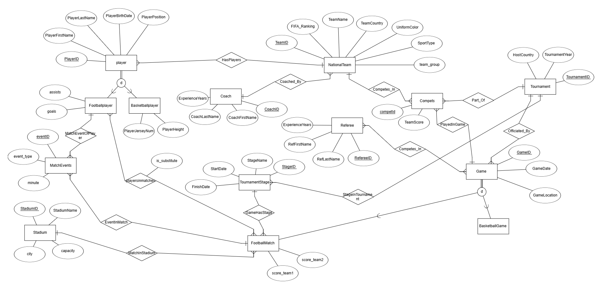

# מערכת ניהול טורניר כדורסל בין נבחרות  
מגישה: שרה בורגן  
היחידה הנבחרת: טורניר לאומי

---

## תוכן עניינים  
- [מבוא](#מבוא)  
- [ERD – תרשים ישויות וקשרים](#erd--תרשים-ישויות-וקשרים)  
- [DSD – תרשים מבנה נתונים](#dsd--תרשים-מבנה-נתונים)  
- [החלטות עיצוב](#החלטות-עיצוב)  
- [שיטות הכנסת נתונים](#שיטות-הכנסת-נתונים)  
  - [שיטה 1: Mockaroo](#שיטה-1-mockaroo)  
  - [שיטה 2: GenerateData](#שיטה-2-generatedata)  
  - [שיטה 3: Python Script](#שיטה-3-python-script)  
- [גיבוי ושחזור](#גיבוי-ושחזור)
- [שלב ב – שאילתות ועדכונים](#שלב-ב--שאילתות-ועדכונים)
  - [שאילתות SELECT](#שאילתות-select)
  - [שאילתות UPDATE](#שאילתות-update)
  - [שאילתות DELETE](#שאילתות-delete)
  - [אילוצים Constraints](#אילוצים-constraints)
- [שלב ג – אינטגרציה ומבטים](#שלב-ג--אינטגרציה-ומבטים)
  - [תרשים ERD](#תרשים-erd)
  - [תרשים DSD](#תרשים-dsd)
  - [החלטות אינטגרציה](#החלטות-אינטגרציה)
  - [מבט 1 – שחקני כדורסל לפי נבחרת](#מבט-1--שחקני-כדורסל-לפי-נבחרת)
  - [מבט 2 – שחקני כדורגל לפי משחקים](#מבט-2--שחקני-כדורגל-לפי-משחקים)

---

## מבוא

מסד הנתונים של טורניר הכדורסל בין נבחרות לאומיות נבנה כדי לעזור לנהל בצורה מסודרת את כל מה שקשור לטורניר: קבוצות, שחקנים, מאמנים, שופטים, משחקים וטורנירים שמתקיימים כל שנה.

המערכת מאפשרת לשמור ולעקוב אחרי כל הפרטים שצריך – כמו מי שיחק מול מי, איזה שופט שפט איזה משחק, כמה נקודות כל קבוצה קיבלה, מי המאמן של כל קבוצה, ועוד.

### מטרת מסד הנתונים

המערכת נועדה לאפשר:

- רישום של קבוצות (נבחרות לאומיות) עם שם, מדינה, צבע מדים ומאמן.
- תיעוד של טורנירים לפי שנה ומדינה מארחת.
- יצירת משחקים כחלק מהטורניר.
- שיבוץ שופטים לכל משחק.
- שמירת תוצאה של כל קבוצה בכל משחק.
- תיעוד של שחקנים – כולל שם, תאריך לידה, גובה, תפקיד בקבוצה ומספר חולצה.

### שימושים אפשריים

- מנהלי הטורניר יכולים לתכנן בקלות את הטורניר, לנהל את הקבוצות, לקבוע משחקים ולשבץ שופטים.
- מאמנים יכולים לראות מי נמצא בקבוצה שלהם, לעקוב אחרי משחקים ולנתח תוצאות.
- שופטים משובצים למשחקים לפי הצורך, והמערכת שומרת את המידע הזה.
- סטודנטים או מנהלי מידע יכולים לשלוף מידע וסטטיסטיקות על קבוצות, שחקנים וטורנירים.

### למה זה חשוב

מסד הנתונים עוזר לעשות סדר בכל המידע שקשור לטורניר. הוא שומר על דיוק, מאפשר שליפות מהירות של מידע, ויכול בעתיד גם להתחבר לאתר או מערכת חיצונית להצגת התוצאות.

---

## ERD – תרשים ישויות וקשרים  

---

## DSD – תרשים מבנה נתונים  

---

## החלטות עיצוב

- שימוש בטבלת Compets לקישור תוצאות משחקים עם קבוצות, משחקים וטורנירים.
- שימוש בטבלת Officiated_By עם מפתח משולב GameID + RefereeID.
- כל שחקן שייך לנבחרת אחת בלבד (TeamID).
- כל משחק שייך לטורניר אחד בלבד.

---

## שיטות הכנסת נתונים

### שיטה 1: Mockaroo  
שימש ליצירת נתונים עבור הטבלאות:
- Coach
- Game  
- Referee  
- Tournament  

קבצים לדוגמה:  
- [CoachMOCK_DATA.csv](שלב%20א/mockarooFiles/CoachMOCK_DATA.csv)  
- [GameMOCK_DATA.csv](שלב%20א/mockarooFiles/GameMOCK_DATA.csv)  
- [RefereeMOCK_DATA.csv](שלב%20א/mockarooFiles/RefereeMOCK_DATA.csv)  
- [TournamentMOCK_DATA.csv](שלב%20א/mockarooFiles/TournamentMOCK_DATA.csv)

תמונה:

---

### שיטה 2: GenerateData  
שימש ליצירת נתונים עבור:
- Compets  
- NationalTeam  

קבצים לדוגמה:  
- [Competsgeneratedata.csv](שלב%20א/generatedataFiles/Competsgeneratedata.csv)  
- [nationalteamgenerateData.csv](שלב%20א/generatedataFiles/nationalteamgenerateData.csv)

תמונה:

---

### שיטה 3: Python Script  
שימש ליצירת פקודות SQL עבור:
- Officiated_By  

קבצי קוד:  
- [generate_officiated_by.py](שלב%20א/Programing/generate_officiated_by.py)

קבצי פלט:  
- [insert_officiated_by.sql](שלב%20א/Programing/insert_officiated_by.sql)

תמונה:

---

## גיבוי ושחזור
תהליך הגיבוי בוצע באמצעות pgAdmin על ידי ייצוא קובץ `.sql`:

- הקובץ שנשמר:  
  [שלב א/Backup/backup_22_04_2025_11-21.backup](שלב%20א/Backup/backup_22_04_2025_11-21.backup)
  
שחזור הנתונים בוצע באמצעות ייבוא הקובץ חזרה ל־pgAdmin.

תהליך שחזור-

---
## שלב ב – שאילתות ועדכונים

### שאילתות SELECT
שאילתא 1 – שם נבחרת, כמות שחקנים ושם המאמן
 
שאילתא זו מציגה לכל נבחרת את המידע הבא:
שם הקבוצה (TeamName),
מספר השחקנים בקבוצה (PlayerCount),
שם המאמן (פרטי ומשפחה).
השאילתא מבצעת חיבור (JOIN) בין הטבלאות NationalTeam, Player ו־Coach, ומקבצת (GROUP BY) לפי שם הנבחרת ושם המאמן.
זוהי שאילתא שימושית להצגת תמונת מצב של הקבוצות, כמות השחקנים ומי מאמן אותן.
 

צילום הרצה:

צילום תוצאה:

 

שאילתא 2 – כמות משחקים וקבוצות שמשחקות בכל חודש ושנה
 
שאילתא זו מציגה את הפעילות של משחקים לפי זמן – לכל שנה וחודש:
השנה שבה התקיימו המשחקים (Year),
החודש בתוך אותה שנה (Month),
מספר המשחקים השונים שנערכו (NumOfGames),
מספר הקבוצות השונות שהשתתפו באותם משחקים (NumOfTeams).
השאילתא מבצעת חיבור (JOIN) בין טבלת Game לטבלת Compets, משתמשת ב־EXTRACT כדי לחלץ את השנה והחודש מתוך התאריך, ומקבצת (GROUP BY) לפי שנה וחודש.
מטרת השאילתא היא לנתח פעילות חודשית של טורנירים – כמה משחקים התקיימו וכמה קבוצות השתתפו.
 

צילום הרצה:

צילום תוצאה:

 

שאילתא 3 – השחקן הגבוה ביותר מכל נבחרת
 
שאילתא זו מציגה את השחקן הגבוה ביותר בכל קבוצה:
מזהה השחקן (PlayerID),
שם פרטי ושם משפחה של השחקן,
שם הקבוצה שהוא שייך אליה,
הגובה של השחקן (PlayerHeight).
השליפה נעזרת ב־JOIN בין Player ל־NationalTeam, וב־WHERE עם תת־שאילתה שמחזירה את הגובה הגבוה ביותר לכל TeamID.
כך מתקבלת רשימה שמציגה שחקן אחד (הכי גבוה) לכל קבוצה.
בנוסף, כל התוצאה ממוינת מהגבוה ביותר ומטה.
מטרת השאילתא היא לאפשר לבעלי קבוצות לזהות את השחקן הגבוה ביותר בכל נבחרת, מתוך מטרה לשקול רכישה של שחקנים בולטים שיכולים לתרום משמעותית לביצועים על המגרש.
 

צילום הרצה:

צילום תוצאה:

 

שאילתא 4 – ממוצע דירוג פיב״א לפי מיקום המשחק
 
שאילתא זו מציגה את איכות הקבוצות לפי מיקומים גאוגרפיים שבהם התקיימו משחקים, לפי דירוג פיב״א:
מיקום המשחק (GameLocation),
ממוצע דירוג פיב״א של הקבוצות ששיחקו באותו מיקום (AvgFibaRanking),
מספר המשחקים שהתקיימו באותו מקום,
מספר הקבוצות השונות שהשתתפו באותם משחקים.
השאילתא עושה שימוש ב־JOIN בין Game, Compets ו־NationalTeam, תוך כדי שימוש ב־AVG ו־ROUND כדי לחשב את ממוצע הדירוג בצורה מדויקת.
מיון התוצאה מתבצע לפי המיקומים עם הדירוג הממוצע הנמוך ביותר – כלומר המקומות שבהם שיחקו הקבוצות החזקות ביותר (עם דירוג נמוך).
מטרת השאילתא היא לעזור למנהלי הטורניר לזהות מקומות שמושכים קבוצות איכותיות ולתכנן שם טורנירים עתידיים.
 

צילום הרצה:

צילום תוצאה:

 

שאילתא 5 – מספר משחקים ששפט כל שופט בכל שנה
 
שאילתא זו מציגה עבור כל שופט את מספר המשחקים שהוא שפט, לכל שנה בנפרד:
מזהה השופט (RefereeID),
שם פרטי ושם משפחה של השופט,
השנה שבה התקיימו המשחקים,
מספר המשחקים שהשופט שפט באותה שנה.
השאילתא משתמשת ב־JOIN בין הטבלאות Referee, Officiated_By ו־Game, ומבצעת GROUP BY לפי שופט ושנה.
בנוסף, נעשה שימוש ב־EXTRACT(YEAR) כדי לשלוף את השנה מתוך תאריך המשחק, ו־ORDER BY כדי למיין את התוצאה תחילה לפי שנה ואז לפי כמות המשחקים באופן יורד.
מטרת השאילתא היא לספק ניתוח סטטיסטי של היקף השיפוט של כל שופט לאורך השנים, ולזהות שופטים פעילים במיוחד
 

צילום הרצה:

צילום תוצאה:

 

שאילתא 6 – מיון שחקנים לפי עמדה
 
שאילתא זו מציגה רשימה של כל השחקנים במערכת, כשהם ממוינים לפי העמדה שבה הם משחקים:
מזהה השחקן (PlayerID),
שם פרטי ושם משפחה,
שם הנבחרת שאליה הוא שייך,
העמדה של השחקן (PlayerPosition).
השאילתא מצטרפת בין טבלאות Player ו־NationalTeam בעזרת JOIN, וממיינת את התוצאה לפי העמדה (PlayerPosition) ולאחר מכן לפי שם משפחה של השחקן.
כך ניתן לראות את כל השחקנים המחולקים לפי תפקיד – למשל: כל הסנטרים יחד, כל הגארדים יחד, וכן הלאה.
מטרת השאילתא היא לאפשר ניתוח של פריסת העמדות של כלל השחקנים בתחרות, במטרה להבין אילו עמדות דומיננטיות יותר, ולבחון את הרכב הקבוצות המתחרות מבחינת תפקוד על המגרש
 

צילום הרצה:

צילום תוצאה:

 

שאילתא 7 – משחקים שבהם הפרש הנקודות היה יותר מ־20
 
שאילתא זו מציגה את כל המשחקים שבהם התקיים הפרש של יותר מ־20 נקודות בין שתי הקבוצות.
מזהה המשחק (GameID),
תאריך המשחק,
מיקום המשחק,
הפרש הנקודות (ההפרש בין הקבוצה עם הכי הרבה נקודות לבין הקבוצה עם הכי מעט).
השליפה מצטרפת בין Game ל־Compets באמצעות JOIN, ומקבצת לפי מזהה המשחק.
היא משתמשת ב־HAVING כדי לסנן רק את המשחקים שבהם ההפרש בין התוצאה הגבוהה ביותר לנמוכה ביותר גדול מ־20.
מטרת השאילתא היא לעזור לצוות המקצועי ולמארגני הטורניר לנתח משחקים חד־צדדיים, ולהבין אילו קבוצות הציגו יתרון בולט במיוחד.
 

צילום הרצה:

צילום תוצאה:

 

שאילתא 8 – השחקן הצעיר ביותר בכל נבחרת
 
שאילתא זו מציגה את השחקן הכי צעיר בכל נבחרת (קבוצה), כלומר השחקן עם תאריך הלידה המאוחר ביותר בכל קבוצה:
מזהה השחקן (PlayerID),
שם פרטי ושם משפחה,
שם הנבחרת,
תאריך הלידה של השחקן.
השאילתא משתמשת ב־JOIN בין Player ל־NationalTeam, ובתת־שאילתה שמחזירה את תאריך הלידה המאוחר ביותר (MAX(PlayerBirthDate)) עבור כל TeamID.
לכל שחקן שנמצא תאריך זהה לזה שבתת־השאילתה – יוצג ברשימה.
מטרת השאילתא היא לאפשר למאמנים ולעוזרי מאמן לזהות את השחקנים הצעירים ביותר בכל נבחרת, לצורך פיתוח עתידי, קידום כישרונות צעירים או קבלת החלטות מקצועיות.
 

צילום הרצה:

צילום תוצאה:

 

---

### שאילתות UPDATE
שאילתא – UPDATE 1- הגדלת שנות ניסיון למאמנים של קבוצות ששיחקו מעל 5 משחקים
 
שאילתא זו מעדכנת את ערך ExperienceYears (שנות ניסיון) בטבלת Coach.
היא מאתרת את כל המאמנים שהקבוצות שלהם השתתפו ביותר מ־5 משחקים, ומוסיפה להם שנה אחת של ניסיון.
השאילתt מצרפת את הטבלאות NationalTeam ו־Compets, ומקבצת לפי CoachID
עבור כל מאמן שמספר המשחקים של קבוצתו גדול מ־5 – השאילתt מעדכנת את שנות הניסיון שלו
מטרת השאילתא היא לדמות מצב שבו ניסיון מקצועי של מאמנים עולה בהתאם לפעילות בפועל בטורנירים.
 
צילום לפני העדכון:

צילום של הרצת השאילתא:

צילום אחרי העדכון:

 
שאילתא – UPDATE 2- הפחתת גובה רנדומלית (10–15 ס"מ) לשחקנים גבוהים מ־210 ס"מ

 
שאילתא זו מבצעת עדכון על טבלת Player ומפחיתה באופן רנדומלי בין 10 ל־15 ס"מ מגובה של שחקנים שגובהם מעל 210 ס"מ.
נבחרים רק שחקנים עם PlayerHeight > 210
לכל אחד מהם מופחת מספר רנדומלי בין 10 ל־15 באמצעות שימוש ב־RANDOM() ו־FLOOR()
כל שחקן מקבל ערך שונה בהתאם לתוצאה הרנדומלית.
מטרת השאילתא היא לדמות תיקון לטעויות הקלדה שגרמו לרישום גובה גבוה מדי.
 
צילום לפני העדכון:

צילום של הרצת השאילתא:

צילום אחרי העדכון:

 
שאילתא – UPDATE 3- עדכון עמדת שחקנים גבוהים ל־"Center"

 
שאילתא זו מעדכנת את טבלת Player ומשנה את העמדה (PlayerPosition) של כל שחקן שגובהו מעל או שווה ל־205 ס"מ ל־"Center", אך רק אם לא כבר מוגדר כ־Center.
נבחרים שחקנים עם PlayerHeight >= 205
מתבצעת בדיקה שעמדתם הנוכחית אינה Center (כדי להימנע מכפילות בעדכון)
אם התנאים מתקיימים – העמדה שלהם משתנה ל־Center
מטרת השאילתא היא ליישר קו בין נתוני השחקן לבין המציאות: שחקנים גבוהים במיוחד מתאימים לעמדת Center (סנטר), ולכן המערכת מעדכנת זאת אוטומטית.
 
צילום לפני העדכון:

צילום של הרצת השאילתא:

צילום אחרי העדכון:

 

---
### שאילתות DELETE
שאילתא- DELETE 1 – מחיקת רשומות מטבלת Compets עבור קבוצות שאין להן שחקנים
 
שאילתא זו מוחקת את ההשתתפויות בטורנירים (Compets) של קבוצות שאין להן אף שחקן בטבלת Player.
המחיקה נדרשת כדי לשחרר את אותן קבוצות מתלות של foreign key, מה שיאפשר למחוק אותן אח"כ גם מטבלת NationalTeam.
מטרת השאילתא היא להכין את הקרקע למחיקת קבוצות לא פעילות, מבלי לפגוע בשלמות הקשרים במסד.
 
צילום לפני המחיקה:

צילום של הרצת השאילתא:

צילום אחרי המחיקה:

 

שאילתא – DELETE 2-מחיקת קבוצות שאין להן אף שחקן
 
שאילתא זו מוחקת מהטבלה NationalTeam את כל הקבוצות (נבחרות) שלא משויכים אליהן שחקנים.
הכוונה היא לקבוצות שאין להן אף שחקן בטבלת Player (כלומר TeamID שלהן לא מופיע שם כלל).
מתבצעת בדיקה של כל TeamID בטבלת NationalTeam
אם אותו TeamID אינו מופיע בטבלת Player – הקבוצה תימחק
מטרת השאילתא היא לנקות את מסד הנתונים מקבוצות לא פעילות או שגויות שהוזנו ללא שחקנים.
 
צילום לפני המחיקה:

צילום של הרצת השאילתא:

צילום אחרי המחיקה:

 
שאילתא –DELETE 3 – מחיקת שופטים שלא שפטו אף משחק
 
שאילתא זו מוחקת מהטבלה Referee את כל השופטים שלא שפטו אפילו משחק אחד.
הבדיקה מתבצעת על ידי שימוש ב־NOT IN מול טבלת Officiated_By, שמכילה את הקשרים בין שופטים למשחקים.
רק שופטים שמזהה שלהם לא מופיע כלל בטבלת Officiated_By יימחקו.
מטרת השאילתא היא לנקות את המערכת משופטים לא פעילים או כאלו שהוזנו למערכת בטעות.
 
צילום לפני המחיקה:

צילום של הרצת השאילתא:

צילום אחרי המחיקה:

 
---

### אילוצים (Constraints)

אילוץ 1- שנות ניסיון של מאמן
 
אילוץ מסוג CHECK המגביל את הערכים בשדה ExperienceYears בטבלת Coach לתחום שבין 0 ל־50. מטרת האילוץ היא למנוע הזנת ערכים שליליים או בלתי סבירים.

ניסיון להפר את האילוץ:

 
אילוץ 2- DEFAULT על שנות ניסיון של שופט
 
אילוץ מסוג DEFAULT בטבלה Referee אשר מגדיר שערך ברירת המחדל של השדה ExperienceYears יהיה 1 אם לא צוין ערך בעת ההוספה.

ניסיון להכניס שופט בלי לציין ניסיון:

 
אילוץ 3 – NOT NULL על תאריך לידה של שחקן
 
אילוץ מסוג NOT NULL בטבלה Player, אשר מחייב שכל שחקן יקבל ערך בשדה PlayerBirthDate, ואוסר השארת השדה ריק. המטרה- לבדוק שהשחקן בגיל המתאים לשחק.

ניסיון להזין שחקן בלי תאריך לידה:

---
## שלב ג – אינטגרציה ומבטים

## תרשים ERD

## תרשים DSD
phase3/ERDAndDSTFiles/connectedDSD.png

## החלטות אינטגרציה

### מבט 1 – שחקני כדורסל לפי נבחרת

### מבט 2 – שחקני כדורגל לפי משחקים

